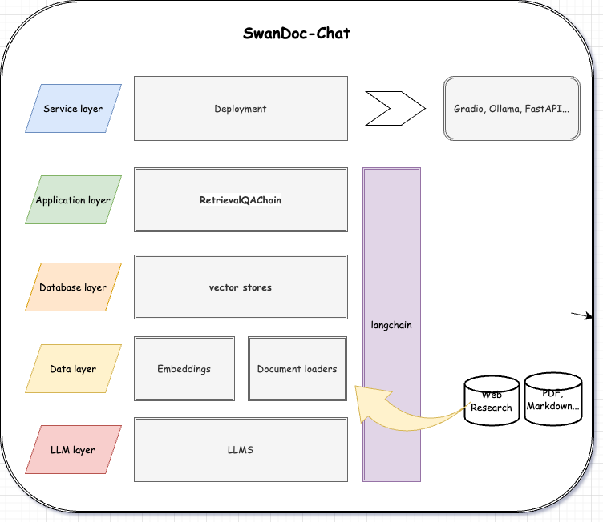
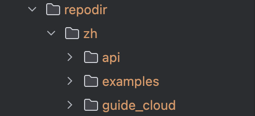

# SwanDoc-Chat

SwanDoc-Chat 是一个基于 SwanLab 官方文档设计的对话小助手，旨在帮助用户快速上手 SwanLab。

SwanLab是一款开源、轻量级的AI实验跟踪工具，提供了一个跟踪、比较、和协作实验的平台，旨在加速AI研发团队100倍的研发效率。欢迎大家给[SwanLab](https://github.com/SwanHubX/SwanLab)
点个 star！同时如果本仓库对你有帮助的话，希望也能得到一个🌟！

## 架构设计概览



## 使用步骤

### Step 1：环境准备

#### 1.1 硬件资源要求

* 操作系统：Windows、macOS、Linux均可
* 有足够显存能够安装并加载对应的模型（"maidalun1020/bce-embedding-base_v1","maidalun1020/bce-reranker-base_v1"）

#### 1.2 python 环境

* python>=3.10
* pytorch>=2.0.0

```python
# 创建 Conda 环境
conda
create - n
swandocchat
python == 3.10
conda
activate
swandocchat
# 安装依赖项
pip
install - r
requirements.txt
```

#### 1.3 .env 文件配置

您需要在项目根目录下创建一个`.env`文件，配置好以下内容：

```python
# GitHub 访问令牌
TOKEN = your_github_access_token

# 任意选择一个 remote llm api
# DeepSeek API 密钥
deepseekapi = your_deepseek_api_key
# Moonshot API 密钥
moonapi = your_moonshot_api_key
# ZhipuAI API 密钥
zhipuapi = your_zhipuapi_api_key
# OpenAI API 密钥
chatgptapi = your_openai_api_key

HF_HOME = './temp/hf_cache'
HF_ENDPOINT = 'https://huggingface.co'
HF_TOKEN = ''
```

请将`your_zhipuapi_api_key`、`your_github_access_token`、`your_deepseek_api_key`、`your_moonshot_api_key` 和
`your_openai_api_key` 替换为您自己的 API 密钥。

### Step 2：数据准备

根目录下创建`repodir`文件夹，前往[SwanLab-Docs](https://github.com/SwanHubX/SwanLab-Docs)克隆仓库，将`zh`文件夹下的内容粘贴至
`repodir`中:



### Step 3: RAG

完成仓库克隆以及所有环境配置后，运行一下命令对`repodir`文件夹内的文件进行特征抽取：

```python
python
get_feature.py
```

### Step 4：提问交互

运行入口文件app.py基于抽取之后的特征数据开始对话

```python
python
app.py
```

## 项目结构

- swchatbot: 包含了所有 RAG 相关的代码
- get_feature.py: 抽取特征信息，保存在本地向量数据库
- app.py: 基于抽取后的特征数据开始对话
- README.md: 项目说明文档

## 贡献指南

欢迎各位同学对本项目进行改进与优化！您可以通过以下方式进行参与：

* Github Issues：在使用 SwanDoc-Chat 时遇到问题可以通过 Issues来记录
* Pull Request：提交你的代码或者文档
* 分享项目，让更多人参加并且受益

## News

- 【2024.9.3】: 🚀最小实践，将仓库转为开放

## 路线图

- [x] 支持 gradio，释放最初简版，包括体验地址(SwanHub)
- [x] 完成可复现文档
- [ ] 支持更多llm模型接口
- [ ] 使用 weaviate 数据库
- [ ] ollama微调glm-flash，并部署服务

## 致谢

感谢 DataWhale 提供了丰富的学习资源！

感谢 SwanLab 开发者提供了一个易用的工具！

以下是一些参考学习项目，也欢迎同学们点一个 star

- [天机:专注人情世故的大语言模型系统。](https://github.com/SocialAI-tianji/Tianji)

- [HuixiangDou: Overcoming Group Chat Scenarios with LLM-based Technical Assistance](https://github.com/InternLM/HuixiangDou)

- [ChatWithDataWhale](https://github.com/sanbuphy/ChatWithDatawhale)
